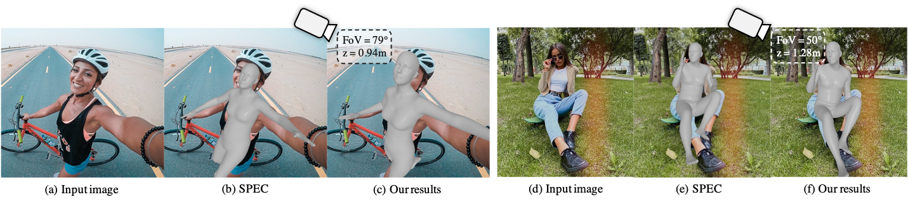

<div align="center">

<h1>Zolly: Zoom Focal Length Correctly for Perspective-Distorted Human Mesh Reconstruction </h1>
</div>



The first work aims to solve 3D Human Mesh Reconstruction task in **perspective-distorted images**. 


# 🗓️ News:

🎆 2023.Nov.23, training code of Zolly is released, pretrained zolly weight will come soon.

🎆 2023.Aug.12, Zolly is selected as ICCV2023 oral, [project page](https://wenjiawang0312.github.io/projects/zolly/).

🎆 2023.Aug.7, the dataset link is released. The training code is coming soon.

🎆 2023.Jul.14, Zolly is accepted to ICCV2023, codes and data will come soon.

🎆 2023.Mar.27, [arxiv link](https://arxiv.org/abs/2303.13796) is released.


# 🚀 Run the code
## 🌏 Environments
- You should install [`MMHuman3D`](https://github.com/open-mmlab/mmhuman3d/blob/main/docs/install.md) firstly.

You should install the needed relies as `ffmpeg`, `torch`, `mmcv`, `pytorch3d` following its tutorials.


- It is recommended that you install the stable version of `MMHuman3D`:

```bash
wget https://github.com/open-mmlab/mmhuman3d/archive/refs/tags/v0.9.0.tar.gz;
tar -xvf v0.9.0.tar.gz;
cd mmhuman3d-0.9.0;
pip install -e .
```

You can install `pytorch3d` from file if you find any difficulty. 
E.g. `python3.8 + pytorch-1.13.1 + cuda-11.7 + pytorch3d-0.7.4`
```bash
wget https://mirrors.tuna.tsinghua.edu.cn/anaconda/cloud/pytorch3d/linux-64/pytorch3d-0.7.4-py38_cu117_pyt1131.tar.bz2;
pip install fvcore;
pip install iopath;
conda install --use-local pytorch3d-0.7.4-py38_cu117_pyt1131.tar.bz2;
```

- install this repo
```bash
cd Zolly;
pip install -e .
```

## 💾 Dataset Preparation

You can download the files from [onedrive](https://connecthkuhk-my.sharepoint.com/:f:/g/personal/wwj2022_connect_hku_hk/EjwloRJZtVBBrgliQ76EP6YBMtVQ5G_D4TPo2n18CAwOyw).

This link contains:

- 💿 annotations:
 all have ground-truth focal length, translation and smpl parameters.
    - HuMMan (train, test_p1, test_p2, test_p3
    - SPEC-MTP (test_p1, test_p2, test_p3)
    - PDHuman (train, test_p1, test_p2, test_p3, test_p4, test_p5)
    - 3DPW (train(has optimized neutral betas), test_p1, test_p2, test_p3)

- 🌁 images.
    - HuMMan
    - SPEC-MTP
    - PDHuman
For other open sourced datasets, please downlad

## 📁 Required files

- pretrained backbone [onedrive](https://connecthkuhk-my.sharepoint.com/:f:/g/personal/wwj2022_connect_hku_hk/EjwloRJZtVBBrgliQ76EP6YBMtVQ5G_D4TPo2n18CAwOyw)
  - `hrnetw48_coco_pose.pth`
  -  `resnet50_coco_pose.pth`

- SMPL skinning weights
  - Please find in [SMPL official link](https://smpl.is.tue.mpg.de/).

- Others [onedrive](https://connecthkuhk-my.sharepoint.com/:f:/g/personal/wwj2022_connect_hku_hk/EjwloRJZtVBBrgliQ76EP6YBMtVQ5G_D4TPo2n18CAwOyw)
  - `smpl_uv_decomr.npz`
  - `mesh_downsampling.npz`
  - `J_regressor_h36m.npy`

## 🚅 Train
```bash
sh train_bash.sh zolly/configs/zolly_r50.py $num_gpu$ --work-dir=$your_workdir$
```
E.g, you can use
```bash
sh train_bash.sh zolly/configs/zolly_r50.py 8 --work-dir=work_dirs/zolly
```
## 🚗 Test
```bash
sh test_bash.sh zolly/configs/zolly/zolly_r50.py $num_gpu$ --checkpoint=$your_ckpt$
```
## Demo 
- For Demo and pretrained checkpoint, Please wait for several days.
<!-- ## 🎮 Demo
```bash
sh demo_bash.sh zolly/configs/zolly/zolly_r50.py $num_gpu$ --checkpoint=$your_ckpt$
``` -->

## 💻Add Your Own Algorithm
- Add your own network in `zolly/models/heads`, and add it to `zolly/models/builder.py`.
- Add your own trainer in `zolly/models/architectures`, and add it to `zolly/models/architectures/builder.py`.
- Add your own config file in `zolly/configs/`, you can modify from `zolly/configs/zolly_r50.py`. And remember to change the `root` parameter in `zolly/configs/base.py`, where your files should be put.

# 🎓 Citation

If you find this project useful in your research, please consider cite:

```
@inproceedings{wangzolly,
  title={Zolly: Zoom Focal Length Correctly for Perspective-Distorted Human Mesh Reconstruction Supplementary Material},
  author={Wang, Wenjia and Ge, Yongtao and Mei, Haiyi and Cai, Zhongang and Sun, Qingping and Wang, Yanjun and Shen, Chunhua and Yang, Lei and Komura, Taku},
  booktitle={Proceedings of the IEEE International Conference on Computer Vision (ICCV)},
  year={2023}
}
```
# 📧 Contact

Feel free to contact me for other questions or cooperation: wwj2022@connect.hku.hk
