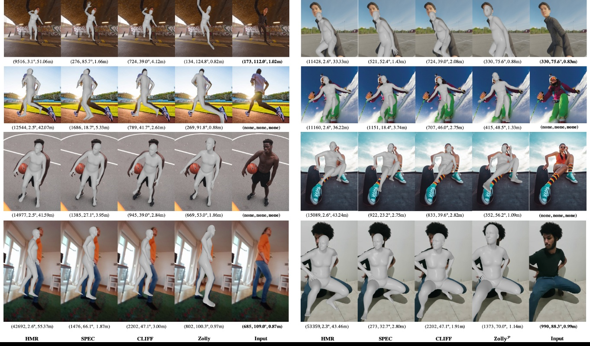

<div align="center">

<h1>Zolly: Zoom Focal Length Correctly for Perspective-Distorted Human Mesh Reconstruction </h1>
</div>


The first work aims to solve 3D Human Mesh Reconstruction task in **perspective-distorted images**. 


# 🗓️ News:
🎆 2023.Jul.14, Zolly is accepted to ICCV2023, codes and data will come soon.

🎆 2023.Mar.27, [arxiv link](https://arxiv.org/abs/2303.13796) is released.


# 🚀 Run the code
## 🌏 Environments
- Requirements
    - Pytorch3D
    - MMHuman3D

## 💾 Dataset Preparation (Will be released soon)
- 💿 Preprocessed npzs, all has ground-truth focal length, translation and smpl parameters.
    - HuMMan (train, test_p1, test_p2, test_p3)
    - SPEC-MTP (test_p1, test_p2, test_p3)
    - PDHuman (train, test_p1, test_p2, test_p3, test_p4, test_p5)
    - 3DPW (train(has optimized neutral betas), test_p1, test_p2, test_p3)
    - Human3.6M (train, val_p2)

- 🌁 Images. (Will be released soon)
    - HuMMan
    - SPEC-MTP
    - PDHuman

## 🚅 Train

## 📺 Test & Demo

## 💻Add Your Algorithm


# 🎓 Citation

If you find this project useful in your research, please consider cite:

```
@article{wang2023zolly,
  title={Zolly: Zoom Focal Length Correctly for Perspective-Distorted Human Mesh Reconstruction},
  author={Wang, Wenjia and Ge, Yongtao and Mei, Haiyi and Cai, Zhongang and Sun, Qingping and Wang, Yanjun and Shen, Chunhua and Yang, Lei and Komura, Taku},
  journal={arXiv preprint arXiv:2303.13796},
  year={2023}
}
```
# 📧 Contact

Feel free to contact me for other questions or cooperation: wwj2022@connect.hku.hk

<!-- icons taken from https://gist.github.com/rxaviers/7360908 -->
<!-- ## Results of Zolly
---


- 3DPW

| Config       | PA-MPJPE | MPJPE |  PVE  |
| ------------ | -------- | ----- |  ---  |
| Zolly(R50)   |   44.1   | 72.5  |  84.3 |
| Zolly(H48)   |   **39.8**   | **65.0**  |  **76.3** |

- H36M

| Config       | PA-MPJPE | MPJPE |
| ------------ | -------- | ----- |
| Zolly(R50)   |   34.2   |  52.7 |
| Zolly(H48)   |   **32.3**   |  **49.4** |


- SPEC-MTP (full)

| Config       | PA-MPJPE | MPJPE | PVE |
| ------------ | -------- | ----- | --- |
| [SPEC(R50)](https://github.com/mkocabas/SPEC)     |    71.8   |   116.1  | 136.4|
| Zolly(R50)   |      66.9    | 109.6      | 124.4    |
| Zolly(H48)   |  **65.8**     | **108.2**  | **121.9** | -->
<!-- 
## Quality Results (For more please refer to our paper.)
 -->