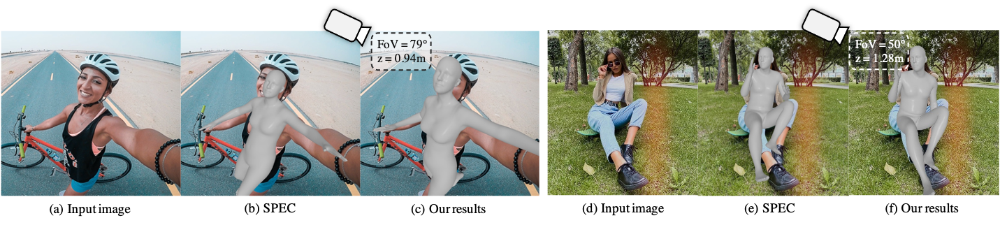
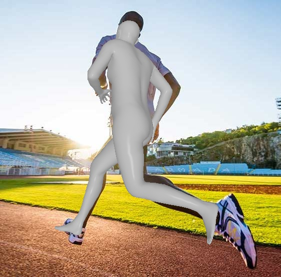
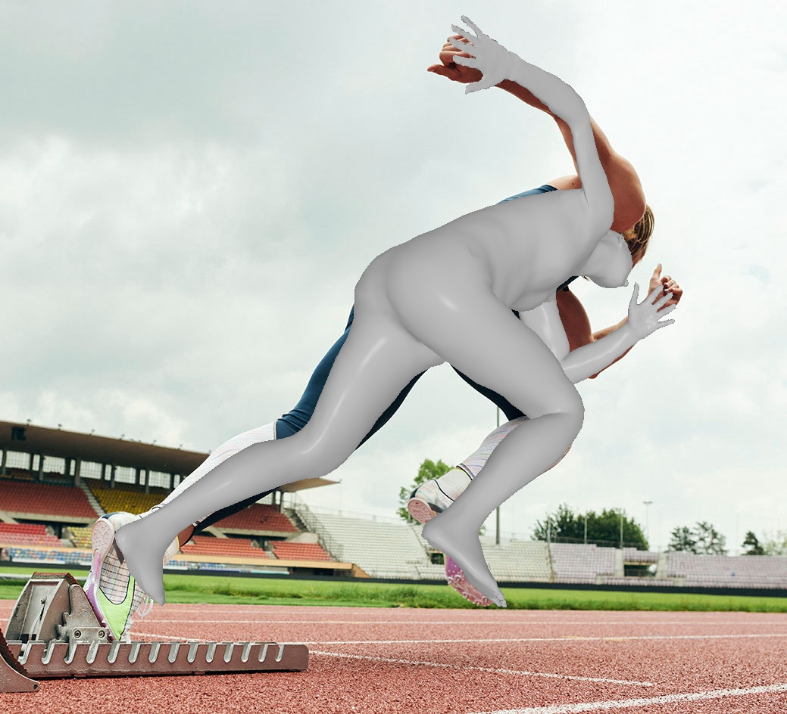

<div align="center">

<h1>[ICCV2023-oral] Zolly: Zoom Focal Length Correctly for Perspective-Distorted Human Mesh Reconstruction </h1>
</div>



The first work aims to solve 3D Human Mesh Reconstruction task in **perspective-distorted images**. 


# 🗓️ News:
🎆 2024.Jul.18, pretrained models are released: https://huggingface.co/WenjiaWang/Zolly_ckpts, most are better than the results in paper.

🎆 2023.Nov.23, the training code of Zolly is released, pretrained Zolly weight will come soon.

🎆 2023.Aug.12, Zolly is selected as ICCV2023 oral, [project page](https://wenjiawang0312.github.io/projects/zolly/).

🎆 2023.Aug.7, the dataset link is released. The training code is coming soon.

🎆 2023.Jul.14, Zolly is accepted to ICCV2023, codes and data will come soon.

🎆 2023.Mar.27, [arxiv link](https://arxiv.org/abs/2303.13796) is released.


# 🚀 Run the code
## 🌏 Environments
- You should install [`MMHuman3D`](https://github.com/open-mmlab/mmhuman3d/blob/main/docs/install.md) firstly.

You should install the needed relies as `ffmpeg`, `torch`, `mmcv`, `pytorch3d` following its tutorials.


- It is recommended that you install the stable version of `MMHuman3D`:

```bash
wget https://github.com/open-mmlab/mmhuman3d/archive/refs/tags/v0.9.0.tar.gz;
tar -xvf v0.9.0.tar.gz;
cd mmhuman3d-0.9.0;
pip install -e .
```

You can install `pytorch3d` from file if you find any difficulty. 
E.g. `python3.8 + pytorch-1.13.1 + cuda-11.7 + pytorch3d-0.7.4`
```bash
wget https://mirrors.tuna.tsinghua.edu.cn/anaconda/cloud/pytorch3d/linux-64/pytorch3d-0.7.4-py38_cu117_pyt1131.tar.bz2;
pip install fvcore;
pip install iopath;
conda install --use-local pytorch3d-0.7.4-py38_cu117_pyt1131.tar.bz2;
```

- install this repo
```bash
cd Zolly;
pip install -e .
```

## 📁 Required Data and Files

You can download the files from [onedrive](https://connecthkuhk-my.sharepoint.com/:f:/g/personal/wwj2022_connect_hku_hk/EjwloRJZtVBBrgliQ76EP6YBMtVQ5G_D4TPo2n18CAwOyw); or from [huggingface](https://huggingface.co/datasets/WenjiaWang/Zolly_release) by command `huggingface-cli download WenjiaWang/Zolly_release --local-dir Zolly_release --repo-type dataset`.

This link contains:

- Dataset annotations:
 all have ground-truth focal length, translation and smpl parameters.
  - HuMMan (train, test_p1(full), test_p2, test_p3)
  - SPEC-MTP (test_p1(full), test_p2, test_p3)
  - PDHuman (train, test_p1(full), test_p2, test_p3, test_p4, test_p5)
  - 3DPW (train(has optimized neutral betas), test_p1(full), test_p2, test_p3)

- Dataset images.
  - HuMMan
  - SPEC-MTP
  - PDHuman
  - For other open sourced datasets, please downlad from their original website.

- Pretrained backbone
  - `hrnetw48_coco_pose.pth`
  -  `resnet50_coco_pose.pth`

- Others
  - `smpl_uv_decomr.npz`
  - `mesh_downsampling.npz`
  - `J_regressor_h36m.npy`

- SMPL skinning weights
  - Please find in [SMPL official link](https://smpl.is.tue.mpg.de/).
  
## 👇 Arrange the files
<details>
<summary>Click here to unfold.</summary>

```bash
root
  ├── body_models
  │   └── smpl
  |       ├── J_regressor_extra.npy
  |       ├── J_regressor_h36m.npy
  |       ├── mesh_downsampling.npz
  |       ├── SMPL_FEMALE.pkl
  |       ├── SMPL_MALE.pkl
  |       ├── smpl_mean_params.npz
  |       ├── SMPL_NEUTRAL.pkl
  |       └── smpl_uv_decomr.npz
  ├── cache
  ├── mmhuman_data
  │   ├── datasets                                                                                
  |   │   ├── coco                                                                                   
  |   │   ├── h36m                                              
  |   │   ├── humman                                            
  |   │   ├── lspet                                             
  |   │   ├── mpii                                              
  |   │   ├── mpi_inf_3dhp                                      
  |   │   ├── pdhuman                                                                                 
  |   │   ├── pw3d                                              
  |   │   └── spec_mtp  
  │   └── preprocessed_datasets
  |       ├── humman_test_p1.npz
  |       ├── humman_train.npz
  |       ├── pdhuman_test_p1.npz
  |       ├── pdhuman_train.npz
  |       ├── pw3d_train.npz
  |       ├── pw3d_train_transl.npz
  |       ├── spec_mtp.npz
  |       └── spec_mtp_p1.npz
  └── pretrain
      └── coco_pretrain 
          ├── hrnetw48_coco_pose.pth
          └── resnet50_coco_pose.pth
```
</details>

 And change the `root` in `zolly/configs/base.py`

## 🚅 Train
```bash
sh train_bash.sh zolly/configs/zolly_r50.py $num_gpu$ --work-dir=$your_workdir$
```
E.g, you can use
```bash
sh train_bash.sh zolly/configs/zolly_r50.py 8 --work-dir=work_dirs/zolly
```

To resume training or finetune model:
```bash
sh train_bash.sh zolly/configs/zolly_r50.py 8 --work-dir=work_dirs/zolly --resume-from work_dirs/zolly/latest.pth
```

## 🚗 Test
```bash
sh test_bash.sh zolly/configs/zolly/zolly_r50.py $num_gpu$ --checkpoint=$your_ckpt$ --data-name pw3d
```
For convenience, you can test the first 100 samples to evaluate your model.
```bash
sh test_bash.sh zolly/configs/zolly/zolly_r50.py $num_gpu$ --checkpoint=$your_ckpt$ --data-name pw3d --num-data 100
```

## 🎮 Demo images in a folder
```bash
sh demo_bash.sh zolly/configs/zolly/zolly_h48.py $num_gpu$ --checkpoint=$your_ckpt$ --image_folder assets/demo_jpg --ext jpg --demo_root demo/
```
The output name will be like `56_789-0.00_586-1.91_pred.png`, which represent `{raw_name}_{gt_f}-{gt_z}_{pred_f}-{pred_z}_pred.png`

 


## Pretrained Models:

We have released our R50 and H48 model on huggingface:
https://huggingface.co/WenjiaWang/Zolly_ckpts

You can use `huggingface-cli download WenjiaWang/Zolly_ckpts --local-dir ckpts --repo-type model` to download the model. (Remember to login with you token firstly)


- We re-trained our method and updated the results for 3DPW, HuMMan, Pdhuman and Spec-MTP:


###  3DPW: most are better than the original paper!
|  Method | PA-MPJPE| MPJPE | PVE |
|----------|----------|----------|----------|
| Zolly-R50 | 48.92👍 | 79.18👍 |  92.82  |
| Zolly-R50 (ft) | 43.70👍 | 71.33👍  |  84.41  |
| Zolly-H48 | 47.88👍 | 78.21   |  90.82  |
| Zolly-H48(ft) | 39.09👍 | 64.44👍  |  75.78👍  |

### SPEC-MTP (p3): comparable to the original paper version
|  Method | PA-MPJPE| MPJPE  | PVE |
|----------|----------|----------|----------|
| Zolly-R50 |  75.34  | 126.66   | 140.69  |
| Zolly-H48 | 67.47 | 115.74 |   127.96  |

### HuMMan (p3): partially better than the original paper version
|  Method | PA-MPJPE| MPJPE |  PVE |
|----------|----------|---------|----------|
| Zolly-R50 | 24.57   | 35.88👍     | 43.49👍   |
| Zolly-H48 |   22.94 | 33.39        | 37.93👍   |

### PDHuman (p5): most are better than the original paper!
|  Method | PA-MPJPE| MPJPE | PVE |
|----------|----------|----------|----------|
| Zolly-R50 |  56.75  | 79.83👍      |  91.93👍  |
| Zolly-H48 |  46.53👍  | 67.86👍    |  77.77👍  |

## 💻Add Your Algorithm
- Add your network in `zolly/models/heads`, and add it to `zolly/models/builder.py`.
- Add your trainer in `zolly/models/architectures`, and add it to `zolly/models/architectures/builder.py`.
- Add your loss function in `zolly/models/losses`, and add it to `zolly/models/losses/builder.py`.
- Add your config file in `zolly/configs/`, you can modify from `zolly/configs/zolly_r50.py`. And remember to change the `root` parameter in `zolly/configs/base.py`, where your files should be put.

# 🎓 Citation

If you find this project useful in your research, please consider citing us:

```
@inproceedings{wangzolly,
  title={Zolly: Zoom Focal Length Correctly for Perspective-Distorted Human Mesh Reconstruction Supplementary Material},
  author={Wang, Wenjia and Ge, Yongtao and Mei, Haiyi and Cai, Zhongang and Sun, Qingping and Wang, Yanjun and Shen, Chunhua and Yang, Lei and Komura, Taku},
  booktitle={Proceedings of the IEEE International Conference on Computer Vision (ICCV)},
  year={2023}
}
```
# 😁 Acknowledge
Emojis are collected from [gist:7360908](https://gist.github.com/rxaviers/7360908#gistcomment-4745876).

Some of the codes are based on [`MMHuman3D`](https://github.com/open-mmlab/mmhuman3d/blob/main/docs/install.md), [`DecoMR`](https://github.com/zengwang430521/DecoMR).

# 📧 Contact

Feel free to contact me for other questions or cooperation: wwj2022@connect.hku.hk

# 💡 Explore More [SMPLCap](https://github.com/SMPLCap) Projects

- [arXiv'25] [SMPLest-X](https://github.com/SMPLCap/SMPLest-X): An extended version of [SMPLer-X](https://github.com/SMPLCap/SMPLer-X) with stronger foundation models.
- [ECCV'24] [WHAC](https://github.com/SMPLCap/WHAC): World-grounded human pose and camera estimation from monocular videos.
- [CVPR'24] [AiOS](https://github.com/SMPLCap/AiOS): An all-in-one-stage pipeline combining detection and 3D human reconstruction. 
- [NeurIPS'23] [SMPLer-X](https://github.com/SMPLCap/SMPLer-X): Scaling up EHPS towards a family of generalist foundation models.
- [NeurIPS'23] [RoboSMPLX](https://github.com/SMPLCap/RoboSMPLX): A framework to enhance the robustness of
whole-body pose and shape estimation.
- [ICCV'23] [Zolly](https://github.com/SMPLCap/Zolly): 3D human mesh reconstruction from perspective-distorted images.
- [arXiv'23] [PointHPS](https://github.com/SMPLCap/PointHPS): 3D HPS from point clouds captured in real-world settings.
- [NeurIPS'22] [HMR-Benchmarks](https://github.com/SMPLCap/hmr-benchmarks): A comprehensive benchmark of HPS datasets, backbones, and training strategies.
